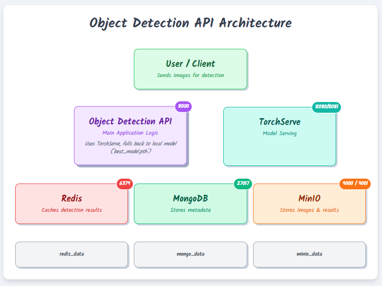

# 🪙 Coin Detection & Segmentation API 🚀

This project focuses on **fine-tuning a Mask R-CNN model** for coin detection & segmentation using a COCO-style dataset, and **deploying it via a FastAPI backend with Docker Compose orchestration**.

---

## 📂 Project Directory Structure

```
challenge_1/
├── .env
├── fine_tune_notebook.ipynb                 # Jupyter notebook for fine-tuning and evaluation with experiment tracking
├── app/                                     # FastAPI application for inference
│   ├── docker-compose.yaml                  # Docker Compose file for multi-container setup
│   ├── Dockerfile                           # API container Dockerfile
│   ├── main.py                              # FastAPI entrypoint
│   ├── models.py                            # Pydantic models for API input/output
│   ├── requirements.txt                     # Python dependencies
│   ├── model/                               # Trained model artifacts (.pth files)
│   ├── utils/                               # Helper modules
│   │   ├── ml/detection.py                  # Core detection logic (inference)
│   │   ├── mongo_client.py                  # MongoDB connector
│   │   └── minio_client.py                  # MinIO (object storage) connector
├── infra/
│   ├── local/                               # Local infra bootstrap scripts
│   │   ├── init_minio.sh
│   │   ├── init_mongo.sh
│   │   └── init_redis.sh
│   └── torchserve/                          # TorchServe deployment scripts and MAR files
│       ├── create_mar.sh
│       ├── Dockerfile
│       ├── init_torchserve.sh
│       ├── maskrcnn_handler.py
│       └── model-store/
│           ├── dummy.mar
│           └── maskrcnn_v2.mar
```

## 🏗️ Project Architecture

Below is a high-level architecture diagram showing how different components interact:




---

## 🏋️‍♂️ Model Training (Fine-Tuning)

- Located in: `fine_tune_notebook.ipynb`
- Uses `maskrcnn_resnet50_fpn_v2` from torchvision
- Trained on COCO-formatted coin dataset with 70:30 data split
- Saved Output `.pth` model weights to be saved in `/app/model/`, currently using best_model.pth
- Saved model weights will not be used in case where TORCHSERVE_API_URL is set

---

## 🧪 API Inference (FastAPI App)

- Located in: `/app/main.py`
- Loads fine-tuned `.pth` models
- Performs object detection and segmentation
- Persists detection metadata to **MongoDB**
- Stores detection result images in **MinIO Object Storage**
- Optional caching layer using **Redis** (TTL = 1 hour)

---


## 🌱 Environment Variables (.env)

The FastAPI application expects the following environment variables (auto-set via Docker Compose):

| Variable | Description                                | Example                                  |
|---|--------------------------------------------|------------------------------------------|
| MONGO_USER | MongoDB username                           | admin                                    |
| MONGO_PASS | MongoDB password                           | admin123                                 |
| MONGO_HOST | MongoDB host                               | localhost:27017                          |
| MINIO_ENDPOINT | MinIO endpoint                             | localhost:9000                           |
| MINIO_ACCESS_KEY | MinIO access key                           | minioadmin                               |
| MINIO_SECRET_KEY | MinIO secret key                           | minioadmin                               |
| MINIO_BUCKET | MinIO bucket name                          | object-detection                         |
| REDIS_HOST | Redis hostname                             | localhost                                |
| REDIS_PORT | Redis port                                 | 6379                                     |
| REDIS_PASSWORD | Redis password                             | your_redis_password                      |
| REDIS_TTL_SECONDS | Cache TTL for Redis (seconds)              | 3600                                     |
| PT_MODEL_PATH | Path to Model Weights for Object detection | default: model/maskrcnn_finetuned_v2.pth |
| TORCHSERVE_API_URL | Model Serving if available                 | default: None                            |

You can optionally add these in your local `.env` file for manual runs.


## 📡 API Endpoints & Example Usage

### 1. **Upload Image**

`POST /upload-image`

Uploads a `.jpg` or `.png` image to MinIO and triggers background object detection.

**Example:**
```bash
curl -X POST http://localhost:8000/upload-image -F "file=@/path/to/image.jpg"
```

**Response:**
```json
{
  "message": "File uploaded successfully",
  "url": "http://localhost:9000/object-detection/{image_name}",
  "file_name": "{uuid_image_name}"
}
```

---

### 2. **Get Detection Result for Image**

`GET /objects/{uuid_image_name}`

Returns detection info (object count, bboxes, centroids, radii) and MinIO visualization URL.

**Response:**
```json
{
  "object_count": 2,
  "objects": [
    {"id": 1, "bbox": [...], "centroid": [...], "radius": ...},
    {"id": 2, "bbox": [...], "centroid": [...], "radius": ...}
  ],
  "visualization_url": "http://localhost:9000/object-detection/{uuid_image_name}_masked.png"
}
```

---

### 3. **Get Object Details**

`GET /objects/{uuid_image_name}/{object_id}`

Returns bounding box, centroid, radius for a specific object.

---

### 4. **Cropped Object Image (Bounding Box Crop)**

`GET /objects/{uuid_image_name}/{object_id}/crop`

Returns image (PNG) of the object's bounding box area.

---

### 5. **Binary Mask Overlay (Segmentation View)**

`GET /objects/{uuid_image_name}/{object_id}/overlay-mask`

Returns a **side-by-side image** with:  
- Left → Original Image  
- Right → Binary mask of the object (white foreground, black background)

**Usage:**
```bash
curl -o overlay.png http://localhost:8000/objects/{uuid_image_name}/{object_id}/overlay-mask
```

**Output:**  
Binary image (PNG), viewable in browsers or tools like Image Viewer.

---

## 🐳 Docker Compose Setup

Run all services together:

```bash
cd app
docker-compose up --build
```

- FastAPI → `localhost:8000`
- MongoDB → `localhost:27017`
- MinIO → `localhost:9000`
- Redis → `localhost:6379`

---

## ✅ Running Tests

```bash
# from ./challenge_1
pytest
```

---

## 🗃️ Postman Collection

Import the included **Postman collection (`AIQ_CH_1.postman_collection.json`)** for quick API testing.

---
