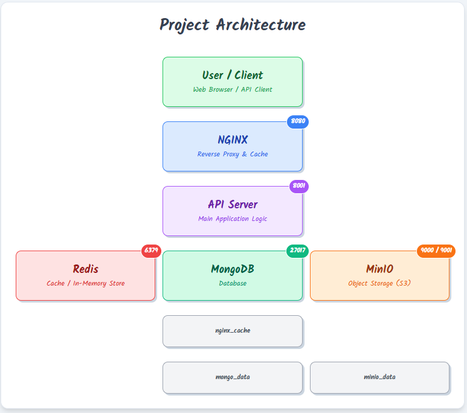
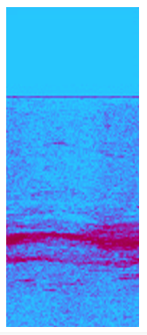

# 📸 Depth-based Frame Stitching API

A FastAPI microservice that serves depth-filtered stitched images from frame data stored in MinIO and metadata stored in MongoDB. Supports Redis caching and an optional NGINX cache layer to simulate a CDN.

---

## 🚀 Features

- ✅ Depth-based filtering of frames
- ✅ Frame storage in MinIO (object storage)
- ✅ Metadata storage in MongoDB
- ✅ Redis-based caching for faster image retrieval
- ✅ NGINX caching for CDN-like simulation
- ✅ Gunicorn with Uvicorn workers for production-grade FastAPI deployment
- ✅ Fully Dockerized (using Docker Compose)
- ✅ Unit Tests with pytest and pytest-asyncio

---

## 🛠️ Tech Stack

- **FastAPI** (Python backend)
- **MongoDB** (Metadata storage)
- **MinIO** (Frame storage)
- **Redis** (Application cache)
- **NGINX** (Reverse proxy & cache layer)
- **Docker Compose**
- **Pytest + pytest-asyncio** (Unit testing)

---

## 🏗️ Project Architecture

Below is a high-level architecture diagram showing how different components interact:




---

## 📂 Directory Structure

```
challenge_2
│   .env
│   api_server.py
│   config.py
│   database.py
│   docker-compose.yaml
│   Dockerfile
│   image_processor.py
│   process_and_persist_image_notebook.ipynb
│   README.md
│   requirements.txt
│
├───tests
│       test_api.py  <-- ✅ Unit Tests
│
├───infra
│   ├───local
│   │       init_minio.sh
│   │       init_mongo.sh
│   │       init_redis.sh
│   │
│   └───nginx
│           nginx.conf
```

---

## ⚙️ Environment Variables

| Variable          | Description             | Example                |
|-------------------|-------------------------|------------------------|
| MONGO_USER        | MongoDB username        | `admin`                |
| MONGO_PASS        | MongoDB password        | `admin123`             |
| MONGO_HOST        | MongoDB host + port     | `mongo:27017`          |
| MINIO_ENDPOINT    | MinIO host + port       | `minio:9000`           |
| MINIO_ACCESS_KEY  | MinIO access key        | `minioadmin`           |
| MINIO_SECRET_KEY  | MinIO secret key        | `minioadmin`           |
| MINIO_BUCKET      | MinIO bucket name       | `challenge-2`          |
| REDIS_HOST        | Redis host              | `redis`                |
| REDIS_PORT        | Redis port              | `6379`                 |
| REDIS_PASSWORD    | Redis password          | `your_redis_password`  |

---

## 📡 API Endpoints

### ▶️ Get Frames by Depth Range

**URL:**  
`GET /frames/?depth_min={min_depth}&depth_max={max_depth}`

**Description:**  
Returns a vertically-stitched PNG image of frames between the specified depth range.

**Example Request (from Postman Collection):**

```
GET http://localhost:8080/frames/?depth_min=9000&depth_max=10000
```

**Example Response (Stitched Image Output):**



**Query Parameters:**

| Param      | Type   | Description                     |
|------------|--------|---------------------------------|
| depth_min  | float  | Minimum depth value             |
| depth_max  | float  | Maximum depth value             |

**Response:**  
- ✅ `200 OK` → Returns image/png stream
- ❌ `404 Not Found` → No frames found for given depth range

---

## ✅ Running Tests

```bash
pytest
```

✅ Unit tests mock MongoDB, MinIO, and Redis so no external services are needed during testing.

---

## 🧱 Building the FastAPI Image Separately (Optional)

```bash
docker-compose up --build
# either run image_processor.py with Challenge2.csv in same directory
# or open process_and_persist_image_notebook.ipynb to persist large image data into DB
```

---

## 📝 NGINX Cache (Local CDN Simulation)

NGINX reverse proxy is configured to cache `/frames/` responses for faster repeated reads.

- NGINX config: `infra/nginx/nginx.conf`
- Cache volume: `nginx_cache`

---

## ✅ Redis Cache Layer (App-side)

Before querying Mongo/Minio, the API checks Redis for cached stitched frames for the given depth range.

Cache TTL: 300 seconds (5 minutes)

---

## 🧹 Cleaning Docker Resources

```bash
docker-compose down -v
```

---

## ✅ Future Improvements (Ideas)

- Add Prometheus/Grafana monitoring
- JWT-based Auth layer
- Use AWS S3 instead of MinIO
- Deploy on Kubernetes

---

## 📌 Author

Built for Challenge-2: Depth-based Image Serving API  
Maintained by: **[Syed Sohail Ali Alvi]**
